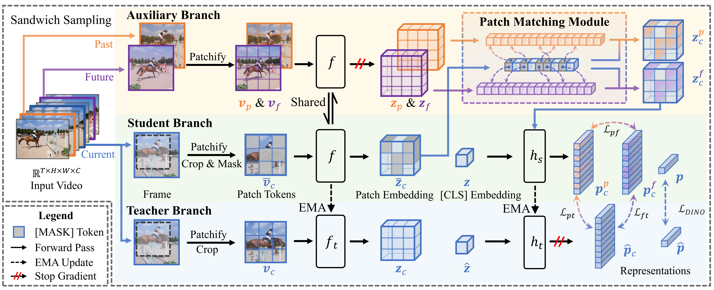

# T-CoRe


This is the official code for the paper "When the Future Becomes the Past: Taming Temporal Correspondence for Self-supervised Video Representation Learning" accepted by Conference on Computer Vision and Pattern Recognition (CVPR 2025). This paper is available at [**here**]().

[]() [](https://github.com/yafeng19/T-CORE) [](https://github.com/yafeng19/T-CORE) [](https://github.com/yafeng19/T-CORE)

**When the Future Becomes the Past: Taming Temporal Correspondence for Self-supervised Video Representation Learning**

**Authors: [Yang Liu](https://yafeng19.github.io/),  [Qianqian Xu*](https://qianqianxu010.github.io/), [Peisong Wen](https://scholar.google.com.hk/citations?user=Zk2XLWYAAAAJ&hl=zh-CN&oi=ao), [Siran Dai](https://scholar.google.com.hk/citations?user=_6gw9FQAAAAJ&hl=zh-CN&oi=ao), [Qingming Huang*](https://people.ucas.ac.cn/~qmhuang)**   




## 🚩 Checkpoints

| Dataset  | Backbone | Epoch | $J\&F_m$         | mIoU | PCK@0.1 | Download |
| -------- | -------- | ----- | ---------------- | ---- | ------- | -------- |
| ImageNet | VIT-S/16 | 100 | 64.1               | 39.7 | 46.2    |  [link](https://github.com/yafeng19/T-CORE/tree/master/ckpt/vits16_100ep_INET.pth) |
| K400     | VIT-S/16 | 400 | 64.7               | 37.8 | 47.0    |  [link](https://github.com/yafeng19/T-CORE/tree/master/ckpt/vits16_400ep_K400.pth) |
| K400     | VIT-B/16 | 200 | 66.4               | 38.9 | 47.1    |  [link](https://github.com/yafeng19/T-CORE/tree/master/ckpt/vitb16_200ep_K400.pth) |

## 💻 Environments

* **Ubuntu** 20.04
* **CUDA** 12.4
* **Python** 3.9
* **Pytorch** 2.2.0

See `requirement.txt` for others.

## 🔧 Installation

1. Clone this repository

    ```bash
    git clone https://github.com/yafeng19/T-CORE.git
    ```

2. Create a virtual environment with Python 3.9 and install the dependencies

    ```bash
    conda create --name T_CORE python=3.9
    conda activate T_CORE
    ```

3. Install the required libraries

    ```bash
    pip install -r requirements.txt
    ```

## 🚀 Training

### Dataset


1. Download Kinetics-400 training set. 
2. Use third-party tools or scripts to extract frames from original videos.
3. Place the frames in `data/Kinetics-400/frames/train`. 
4. Generate files for training data by `python base_model/tools/dump_files.py` and plce the files in `data/Kinetics-400/frames`.
5. Integrate the frames and files into the following structure:
    ```
    T-CoRe
    ├── data
    │   └── Kinetics-400
    │       └── frames
    │           ├── train
    │           │   ├── class_1
    │           │   │   ├── video_1
    │           │   │   │   ├── 00000.jpg
    │           │   │   │   ├── 00001.jpg
    │           │   │   │   ├── ...
    │           │   │   │   └── 00019.jpg
    │           │   │   ├── ...
    │           │   │   └── video_m
    │           │   ├── ...
    │           │   └── class_n
    │           ├── class-ids-TRAIN.npy
    │           ├── class-names-TRAIN.npy
    │           ├── entries-TRAIN.npy
    │           └── labels.txt
    ├── base_model
    └── scripts
    ```


### Scripts

We provide a script with default parameters. Run the following command for training.

```bash
bash scripts/pretrain.sh
```

The well-trained models are saved at [**here**](https://github.com/yafeng19/T-CORE/tree/master/ckpt).

## 📊 Evaluation

### Dataset

In our paper, three dense-level benchmarks are adopted for evaluation.


|  Dataset  |                          Video Task                          |                        Download link                         |
| :-------: | :----------------------------------------------------------: | :----------------------------------------------------------: |
|   DAVIS    |                 Video Object Segmentation                  | [link](https://davischallenge.org/) |
|    JHMDB    |                Human Pose Propagation                | [link](http://jhmdb.is.tue.mpg.de/) |
|  VIP  | Semantic Part Propagation | [link](https://github.com/HCPLab-SYSU/ATEN) |

### Scripts

We provide a script with default parameters. Run the following command for evaluation.

```bash
bash scripts/eval.sh
```


## 🖋️ Citation

If you find this repository useful in your research, please cite the following papers:

<!-- ```
@misc{liu2024pairsequalhierarchicallearning,
      title={Not All Pairs are Equal: Hierarchical Learning for Average-Precision-Oriented Video Retrieval}, 
      author={Yang Liu and Qianqian Xu and Peisong Wen and Siran Dai and Qingming Huang},
      year={2024},
      eprint={2407.15566},
      archivePrefix={arXiv},
      primaryClass={cs.CV},
      url={https://arxiv.org/abs/2407.15566}, 
}
``` -->

## 📧 Contact us

If you have any detailed questions or suggestions, you can email us: liuyang232@mails.ucas.ac.cn. We will reply in 1-2 business days. Thanks for your interest in our work!


## 🌟 Acknowledgements

- Our code is based on the official PyTorch implementation of [DINOv2](https://github.com/facebookresearch/dinov2).  
- The evaluation code is based on [CropMAE](https://github.com/alexandre-eymael/CropMAE).
